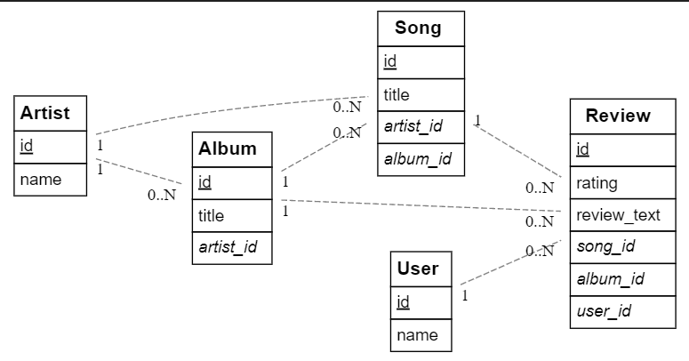
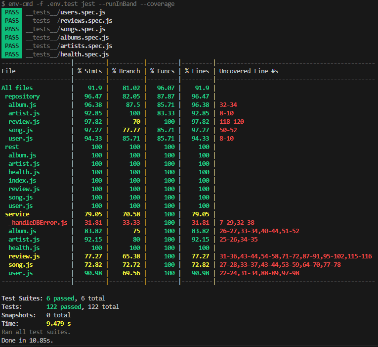

# Jules Goubert (202291428)

-   [ ] Front-end Web Development
-   [x] Web Services:
    -   [Github Reository](https://github.com/Web-IV/2324-webservices-JulesGoubert.git)
    -   [Laatste online versie](https://webservices-julesgoubert.onrender.com)

## Logingegevens

### localhost

**admin:**

-   e-mailadres: bob@gmail.com
-   Wachtwoord: 12345678

**user:**

-   e-mailadres: alice@gmail.com
-   Wachtwoord: 12345678

### online

**admin:**

-   e-mailadres: admin@gmail.com
-   Wachtwoord: 12345678

**user:**

-   e-mailadres: bob@gmail.com
-   Wachtwoord: 12345678

## Projectbeschrijving

Ik heb ervoor gekozen om een CRUD API te maken waar gebruikers reviews kunnen schrijven voor liedjes en albums. Mijn databank bevat vijf entiteiten, een User, Review, Song, Album en Artist. Voor elk van deze entiteiten heb ik alle CRUD operaties geïmplementeerd.
Mijn EERD ziet er als volgt uit:

## API calls

### Users

-   `GET /api/users`: alle users ophalen
-   `GET /api/users/:id`: user met een bepaald id ophalen
-   `POST /api/users/login`: user inloggen
-   `POST /api/users/register`: user registreren
-   `PUT /api/users/:id`: user met een bepaald id updaten
-   `DEL /api/users/:id`: user met een bepaald id verwijderen

### Artists

-   `GET /api/artists`: alle artists ophalen
-   `GET /api/artists/:id`: artist met een bepaald id ophalen
-   `POST /api/artists`: artist aanmaken
-   `PUT /api/artists/:id`: artist met een bepaald id updaten
-   `DEL /api/artists/:id`: artist met een bepaald id verwijderen

### Albums

-   `GET /api/albums`: alle albums ophalen
-   `GET /api/albums/:id`: album met een bepaald id ophalen
-   `POST /api/albums`: album aanmaken
-   `PUT /api/albums/:id`: album met een bepaald id updaten
-   `DEL /api/albums/:id`: album met een bepaald id verwijderen

### Songs

-   `GET /api/songs`: alle songs ophalen
-   `GET /api/songs/:id`: song met een bepaald id ophalen
-   `POST /api/songs`: song aanmaken
-   `PUT /api/songs/:id`: song met een bepaald id updaten
-   `DEL /api/songs/:id`: song met een bepaald id verwijderen

### Reviews

-   `GET /api/reviews`: alle reviews ophalen
-   `GET /api/reviews/:id`: review met een bepaald id ophalen
-   `POST /api/reviews`: review aanmaken
-   `PUT /api/reviews/:id`: review met een bepaald id updaten
-   `DEL /api/reviews/:id`: review met een bepaald id verwijderen

### Health

-   `GET /api/health/ping`: geeft pong terug als de API actief is
-   `GET /api/health/version`: versie van de API ophalen

## Behaalde minimumvereisten

-   **datalaag**

    -   [x] voldoende complex (meer dan één tabel, 2 een-op-veel of veel-op-veel relaties)
    -   [x] één module beheert de connectie + connectie wordt gesloten bij sluiten server
    -   [x] heeft migraties - indien van toepassing
    -   [x] heeft seeds
             

-   **repositorylaag**

    -   [x] definieert één repository per entiteit (niet voor tussentabellen) - indien van toepassing
    -   [x] mapt OO-rijke data naar relationele tabellen en vice versa - indien van toepassing
             

-   **servicelaag met een zekere complexiteit**

    -   [x] bevat alle domeinlogica
    -   [x] bevat geen SQL-queries of databank-gerelateerde code
             

-   **REST-laag**

    -   [x] meerdere routes met invoervalidatie
    -   [x] degelijke foutboodschappen
    -   [x] volgt de conventies van een RESTful API
    -   [x] bevat geen domeinlogica
    -   [x] geen API calls voor entiteiten die geen zin hebben zonder hun ouder (bvb tussentabellen)
    -   [x] degelijke authorisatie/authenticatie op alle routes
             

-   **algemeen**

    -   [x] er is een minimum aan logging voorzien
    -   [x] een aantal niet-triviale integratietesten (min. 1 controller >=80% coverage)
    -   [x] minstens één extra technologie
    -   [x] maakt gebruik van de laatste ES-features (async/await, object destructuring, spread operator...)
    -   [x] duidelijke en volledige README.md
    -   [x] volledig en tijdig ingediend dossier en voldoende commits

## Projectstructuur

> Hoe heb je jouw applicatie gestructureerd (mappen, design patterns...)?

Ik heb gewerkt met een `src` map waar alle logica van de applicatie staat. In die `src` map staan de `core, data, repsitory, rest en service` mappen.

- In de `service` map staat de business logica.
- In de `data` wordt de data beheert.
- In de `rest` map staan alle API endpoints beschreven.
- In de `repository` map staat de communicatie tussen de API en de databank beschreven
- In de `core` map staan algemene zaken die nodig zijn voor authenticatie, authorisatie, validatie, ...

## Extra technologie

De extra technologie die ik gebruikt heb is de Spotify API. Ik heb deze gebruikt om de `songs, artists en albums` tabellen in de databank al in te vullen met de 100 populairste liedjes van Spotify met hun respectievelijke artiesten en albums bij het aanmaken van de databank. Om deze technologie te gebruiken heb ik een Spotify developer account moeten aanmaken. Met dat account kreeg ik een Client ID en een Secret ID waarmee ik de Spotify API kon aanspreken. Ik heb voor deze technologie geen npm package moeten downloaden, ik heb wel gebruik gemaakt van de ingebouwde [`Fetch API`](https://developer.mozilla.org/en-US/docs/Web/API/Fetch_API/Using_Fetch).

## Testresultaten

Ik heb integratietesten geschreven voor elk endpoint van mijn API. Voor elk endpoint wordt er een test uitgevoerd voor een scenario waarin er niets zou moeten mislopen en één of meerder testen voor scenario's waarin er wel iets moet mislopen. Dit zijn de resultaten van mijn testen:

## Gekende bugs

Er zitten geen gekende bugs in mijn API.
